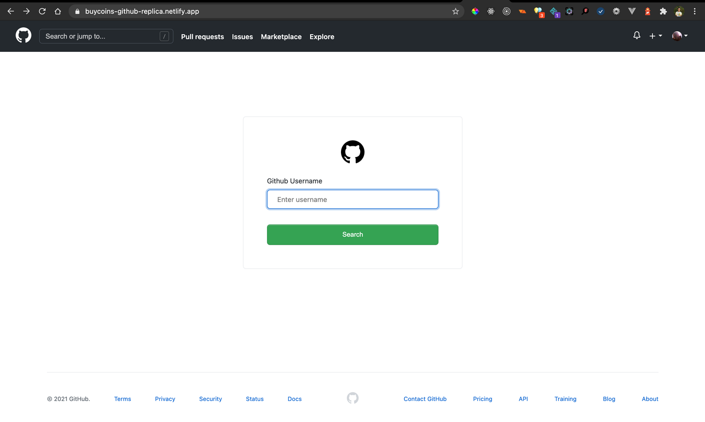
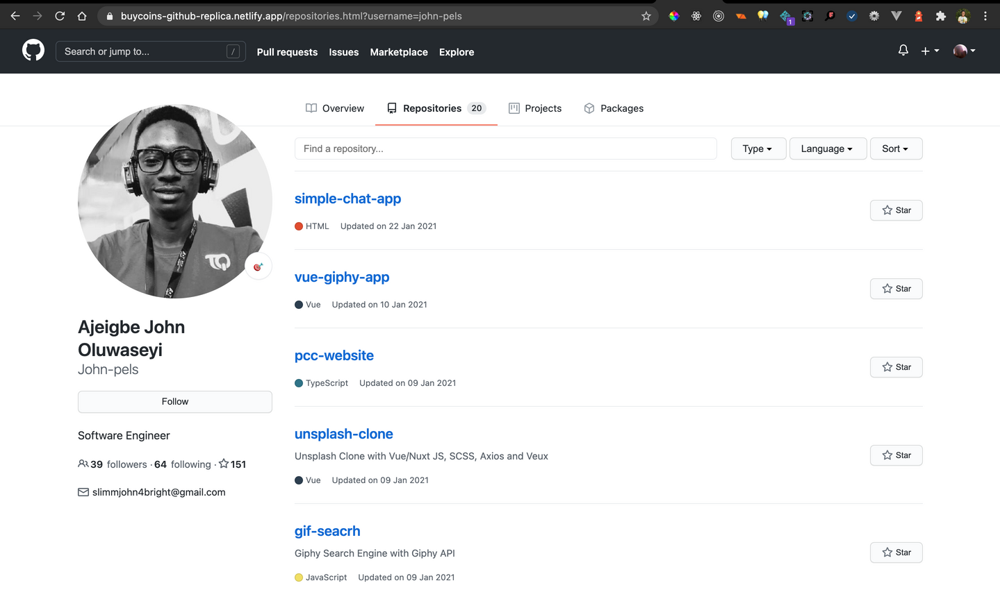

# Vanilla GitHub clone

This GitHub clone runs on the github graphql API to fetch data of a user and recreates the repository tab of the user.

1. A page with an input field that takes a GitHub username
2. Submitting that input should load the profile page for the specified user
3. The responsive design of the website. Make your recreation as close to the real website as possible
4. The profile picture and basic description of the account
5. 20 repositories (maximum)
6. The appearance of your input page should match the style of the profile page
7. A good user experience
